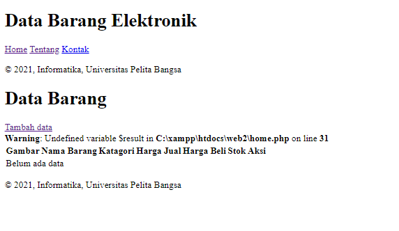

# Latihan-Praktikum-4

## Nama : Imam Solehudin
## Nim  : 312110290
## Kelas: TI.21.C.1
## Matkul: Pemrograman Web2

1. Membuat file program bernama header.php

```php

<!DOCTYPE html>
<html lang="en">
<head>
<meta charset="UTF-8">
<title>Data Gudang</title>
<link href="style.css" rel="stylesheet" type="text/stylesheet"
media="screen" />
</head>
<body>
<div class="container">
<header>
<h1>Data Barang Elektronik </h1>
</header>
<nav>
<a href="home.php">Home</a>
<a href="about.php">Tentang</a>
<a href="kontak.php">Kontak</a>
</nav>
<footer>
    <p>&copy; 2021, Informatika, Universitas Pelita Bangsa</p>
    </footer>
    </div>
    </body>
    </html>
```    
   
2. Membuat file program footer.php

```php

<footer>
    <p>&copy; 2021, Informatika, Universitas Pelita Bangsa</p>
    </footer>
    </div>
    </body>
    </html>
```

3. Membuat file program Home.php

```php
<?php require('header.php'); ?>
<div class="content">

<?include("koneksi.php");
// query untuk menampilkan data
$sql = 'SELECT * FROM data_barang';
$result = mysqli_query($conn, $sql);
?>
<!DOCTYPE html>
<html lang="en">
<head>
    <meta charset="UTF-8">
    <link href="style.css" rel="stylesheet" type="text/css" />
    <title>Data Barang</title>
</head>
<body>
    <div class="container">
        <h1>Data Barang</h1>
            <div class="main">
            <a href="tambah.php">Tambah data</a>
            <table>
            <tr>
                <th>Gambar</th>
                <th>Nama Barang</th>
                <th>Katagori</th>
                <th>Harga Jual</th>
                <th>Harga Beli</th>
                <th>Stok</th>
                <th>Aksi</th>
            </tr>
            <?php if($result): ?>
            <?php while($row = mysqli_fetch_array($result)): ?>
            <tr>
                <td>" alt="<?=
$row['nama'];?>"></td>
                <td><?= $row['nama'];?></td>
                <td><?= $row['kategori'];?></td>
                <td><?= $row['harga_beli'];?></td>
                <td><?= $row['harga_jual'];?></td>
                <td><?= $row['stok'];?></td>
                <td> <a href="ubah.php?id=<?= $row['id_barang'];?>">Ubah data</a>
                <a href="hapus.php?id=<?= $row['id_barang'];?>">Hapus data</a></td>
                </tr>
                <?php endwhile; else: ?>
            <tr>
            <td colspan="7">Belum ada data</td>
            </tr>
            <?php endif; ?>
            </table>
        </div>
    </div>
</body>
</html>

</div>
<?php require('footer.php'); ?>
```

4.Membuat file program about.php

```php
<?php require('header.php'); ?>
<div class="content">
<h2>Ini Halaman About</h2>
<p>Ini adalah bagian content dari halaman.</p>
</div>
<?php require('footer.php'); ?>

```
Hasil Program


